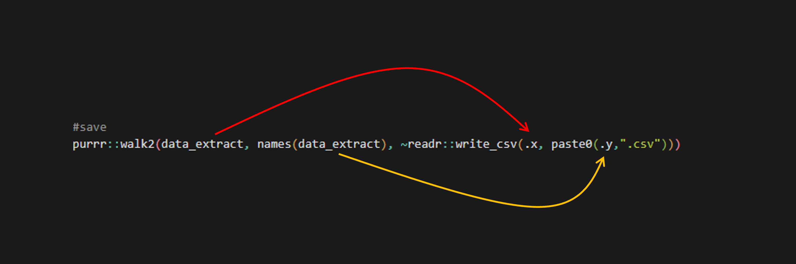

<!-- README.md is generated from README.Rmd. Please edit that file -->

# RcLoggers

<!-- badges: start -->

<!-- badges: end -->

The goal of RcLoggers is to get a complex function that requires too
much memory to run via Shiny onto your computer so you can run it
yourself.

## Installation

To install this package you will first need to download the [RTools
package](https://cran.r-project.org/bin/windows/Rtools/rtools45/rtools.html)
and install it on your computer (accept the defaults everywhere during
the installation process).

Following this, you can install the development version of RcLoggers
from [GitHub](https://github.com/) with:

``` r
# install.packages("pak")
pak::pak("add-am/RcLoggers")
```

## Using The Function

Currently only one function is provided: `logger_extract()`. A basic
example of using this function is as follows:

``` r
#load the library
library(RcLoggers)

#run the function (basic)
data_extract <- logger_extract(
 Years = 2025, 
 Loggers = "BUR2"
)
```

However, this function does have some more advanced options:

``` r
#run the function (detailed)
data_extract <- logger_extract(
 Years = c(2024, 2025), #you can dowload more than one year
 Loggers = c("BUR1", "BUR2"), #you can download more than one logger
 Indicators = "Chlorophyll", # if you only want one indicator you can define that (it defaults to chlorophyll and turbidity)
 FilterFlags = TRUE, #filtering occurs by default, however you can customise or stop filtering
 FlagTags = c(1,2), #by default flags 1 and 2 are kept, you can adjust this as needed
 Aggregate = TRUE, #you can aggregate data
 AggregationType = "Hourly" #if you do decide to aggregate, you need to define the type of aggregation (hourly or daily)
 SmallTables = TRUE #you can request that outputs are broken into several small tables 
 RowCount = 1500 #if you do want to break up tables, you can define the number of rows per table
)
```

To see function documentation use the question mark syntax:

``` r
?logger_extract
```

The output of the function (regardless of if small tables is true or
false) is a list of dataframes. Each item in the list is assigned an
appropriate name, thus it is reccomended that data is saved using the
following code:

``` r
#save
purrr::walk2(data_extract, names(data_extract), ~readr::write_csv(.x, paste0(.y, ".csv")))
```

where .x = data_extract, and .y = the names of items in the list:



Should `SmallTables = TRUE` it is reccomended that files are saved
within broader folders based on logger and year using the following code
(again where .x = data_extract, and .y = the names of items in the
list):

``` r
purrr::walk2(data_extract, names(data_extract), ~{

  #create a folder name based on the first two elements of the dataframe name
  folder_name <- paste(stringr::str_split(.y, pattern = "_")[[1]][1:2], collapse = "_")

  #if you want to expand/move where the folder is located, do that here:
  # folder_name <- paste0("path_to_location/", folder_name)

  #if the folder doesnt already exist, create it
  if (!dir.exists(folder_name)){dir.create(folder_name, recursive = TRUE)}

  #save the dataframe inside the associated folder
  readr::write_csv(.x, paste0(folder_name, "/", .y, ".csv"))

  }
)
```
